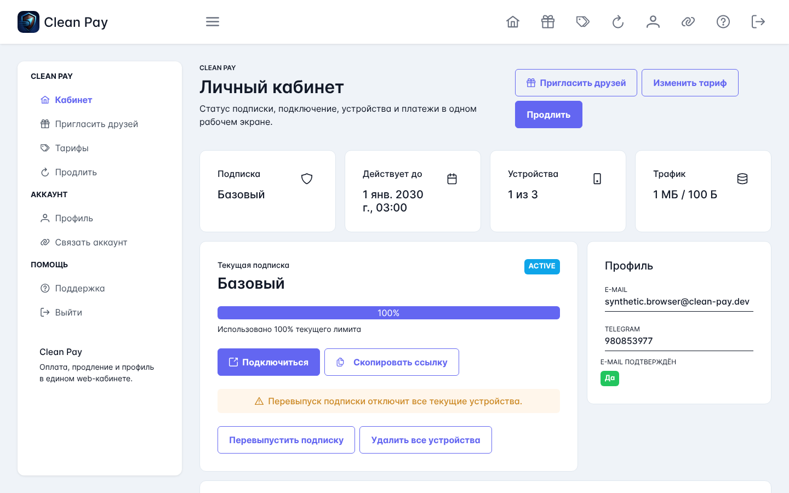
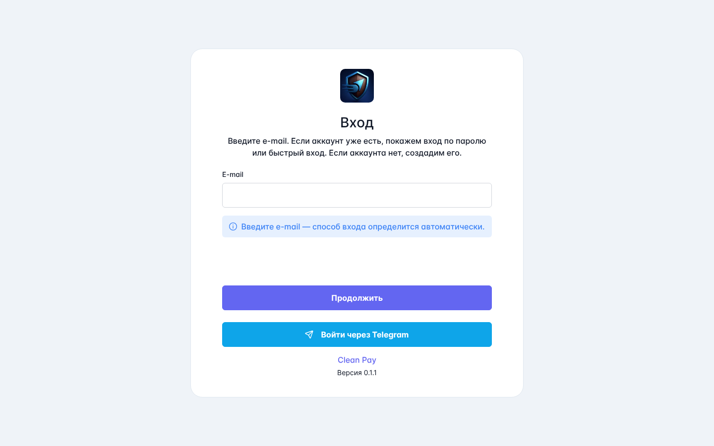
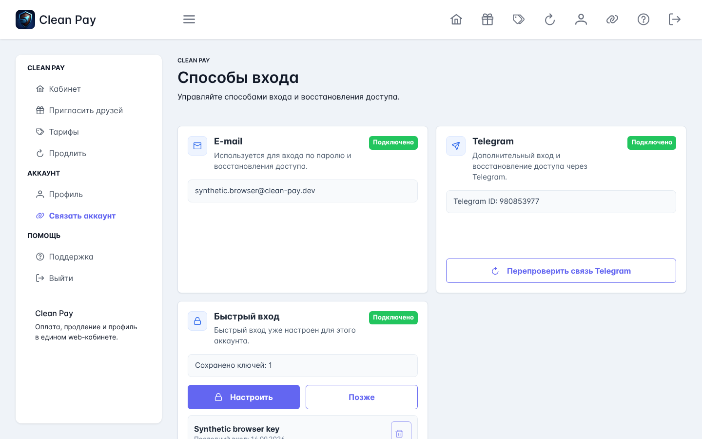

# Clean Pay

Clean Pay — веб-кабинет для оплаты и управления подписками Remnashop/Remnawave.

Приложение разворачивается через Docker Compose и включает собственные PostgreSQL и Redis. Базы данных наружу не публикуются, а веб-приложение по умолчанию доступно только на `127.0.0.1:4000`.

Лицензия: `AGPL-3.0-only`.

## Возможности

- вход по e-mail, Telegram и Passkey;
- покупка и продление подписки;
- управление устройствами и просмотр истории платежей;
- безопасное объединение e-mail и Telegram-аккаунтов;
- идемпотентная обработка платежей и фоновая сверка их статусов;
- healthcheck, аудит, rate limiting и автоматическая очистка устаревших данных;
- PWA и настройка названия, логотипа, Turnstile и контактов поддержки.

## Интерфейс

<p align="center">
  <a href="docs/screenshots/dashboard.png">
    
  </a>
</p>
<p align="center">
  <sub>Личный кабинет: подписка, устройства, трафик и история платежей.</sub>
</p>

<table>
  <tr>
    <td width="50%" valign="top">
      <a href="docs/screenshots/login.png">
        
      </a>
    </td>
    <td width="50%" valign="top">
      <a href="docs/screenshots/authentication-methods.png">
        
      </a>
    </td>
  </tr>
  <tr>
    <td align="center"><sub>Вход по e-mail или через Telegram.</sub></td>
    <td align="center"><sub>Управление e-mail, Telegram и быстрым входом.</sub></td>
  </tr>
</table>

## Требования

- Linux-сервер с Docker Engine и Docker Compose v2;
- работающие Remnashop и Remnawave;
- домен с HTTPS reverse proxy;
- `git` и `openssl` для первоначальной настройки;
- внешняя Docker-сеть, если reverse proxy или соседние сервисы должны обращаться к контейнеру `clean-pay`.

Node.js на сервере устанавливать не требуется.

## Быстрая установка

```bash
sudo mkdir -p /opt/clean-pay
sudo chown "$USER":"$USER" /opt/clean-pay
git clone https://github.com/flake92/clean-pay.git /opt/clean-pay
cd /opt/clean-pay
./deploy.sh init
nano deploy/prod/.env
```

`./deploy.sh init` создаёт `deploy/prod/.env`, устанавливает права `600` и генерирует пароль PostgreSQL и внутренние секреты.

Замените в `.env` все значения `change-me` и адреса `example.com`. Минимальный набор внешних настроек:

```dotenv
APP_URL=https://pay.example.com
NEXT_PUBLIC_APP_URL=https://pay.example.com

REMNASHOP_API_BASE_URL=https://shop.example.com/api/v1/public
REMNASHOP_ADMIN_API_BASE_URL=https://shop.example.com/api/v1/admin
REMNASHOP_API_KEY=<APP_API_KEY из Remnashop>
REMNASHOP_AUTH_SERVICE_KEY=<отдельный внутренний секрет Clean Pay>

REMNAWAVE_API_BASE_URL=https://panel.example.com
REMNAWAVE_TOKEN=<API-токен Remnawave>

TELEGRAM_OIDC_CLIENT_ID=<ID Telegram-бота>
TELEGRAM_OIDC_CLIENT_SECRET=<OIDC client secret>
TELEGRAM_BOT_TOKEN=<токен того же бота>

COOKIE_SECURE=true
```

Запустите приложение:

```bash
./deploy.sh up
```

Команда проверит конфигурацию, создаст отсутствующую Docker-сеть, соберёт образы, запустит сервисы и дождётся успешных healthcheck. После запуска она покажет логи; `Ctrl+C` закрывает только их просмотр, контейнеры продолжат работать.

## Настройка `.env`

Используйте файл, созданный командой `./deploy.sh init`. Не копируйте `.env.example` поверх него: это заменит автоматически созданные секреты.

Основные правила:

- одна переменная `NAME=value` на строку;
- комментарии размещаются на отдельных строках;
- не используйте `${NAME}`, inline-комментарии, многострочные значения и повторяющиеся имена;
- `APP_URL` и `NEXT_PUBLIC_APP_URL` должны содержать один и тот же публичный HTTPS origin;
- сгенерированные секреты должны оставаться разными;
- не публикуйте `.env` и не передавайте его целиком третьим лицам.

Полный перечень переменных и безопасные значения по умолчанию находятся в [`deploy/prod/.env.example`](deploy/prod/.env.example).

### Docker и сеть

| Переменная | Назначение |
| --- | --- |
| `COMPOSE_PROJECT_NAME` | Имя Compose-проекта. Меняйте только до первого запуска. |
| `CLEAN_PAY_IMAGE` | Имя локально собираемого образа. |
| `CLEAN_PAY_BIND` | Адрес публикации приложения; в production допустимы только `127.0.0.1` и `::1`. |
| `CLEAN_PAY_PORT` | Локальный порт приложения, по умолчанию `4000`. |
| `CLEAN_PAY_EDGE_NETWORK` | Внешняя Docker-сеть reverse proxy/Remnawave, по умолчанию `remnawave-network`. |
| `LOG_LEVEL` | `debug`, `info`, `warn` или `error`; для production рекомендуется `info`. |

### Сессии и безопасность

`WEB_JWT_SECRET`, `WEB_REFRESH_SECRET`, `AUDIT_IP_HASH_SECRET`, `RATE_LIMIT_IDENTITY_SECRET` и `READINESS_INTERNAL_SECRET` генерируются автоматически. Каждый секрет должен содержать не менее 32 символов.

`REMNASHOP_AUTH_SERVICE_KEY` — отдельный внутренний секрет Clean Pay, который приложение отправляет только в `/api/v1/public/auth/*`. Он не должен совпадать с admin `REMNASHOP_API_KEY`, попадать в браузер или использоваться внешними клиентами. Remnashop обязан проверять этот заголовок до выполнения auth use case. Не публикуйте порт Remnashop наружу. При общей Docker-сети направляйте `REMNASHOP_API_BASE_URL` на внутренний адрес `http://remnashop:5000/api/v1/public`.

Для публичного HTTPS используйте:

```dotenv
COOKIE_SECURE=true
COOKIE_SAMESITE=lax
```

### Telegram OIDC

`TELEGRAM_OIDC_CLIENT_ID` — числовая часть bot token до `:`. Она должна совпадать с ID в `TELEGRAM_BOT_TOKEN`.

`TELEGRAM_OIDC_CLIENT_SECRET` и `TELEGRAM_BOT_TOKEN` — разные секреты. Официальные Telegram OIDC endpoints уже встроены в приложение, поэтому задавать `TELEGRAM_OIDC_ISSUER`, `TELEGRAM_OIDC_AUTHORIZATION_ENDPOINT`, `TELEGRAM_OIDC_TOKEN_ENDPOINT` и `TELEGRAM_OIDC_JWKS_URI` не требуется.

### Turnstile и поддержка

Cloudflare Turnstile включается так:

```dotenv
TURNSTILE_ENABLED=true
TURNSTILE_SITE_KEY=<production site key>
TURNSTILE_SECRET_KEY=<production secret key>
```

В production `TURNSTILE_ENABLED=true` обязателен. Проверяются точные `action` и hostname, а token нельзя использовать повторно; IP клиента в anti-abuse identity не входит. Общую ёмкость и параллелизм задают `AUTH_RATE_LIMIT_CAPACITY` и `AUTH_CONCURRENCY_LIMIT`.

Контакты поддержки включаются через `SUPPORT_ENABLED=true` и переменные `SUPPORT_EMAIL`, `SUPPORT_TELEGRAM_USERNAME`, `SUPPORT_FAQ_URL`.

### Сверка платежей

Фоновая сверка неоднозначных результатов платежей по умолчанию выключена. Включайте её только после проверки совместимости admin API Remnashop:

```dotenv
PAYMENT_RECONCILIATION_ENABLED=true
PAYMENT_RECONCILIATION_SECRET=<результат openssl rand -hex 32>
PAYMENT_RECONCILIATION_BATCH_SIZE=10
PAYMENT_RECONCILIATION_INTERVAL_SECONDS=30
PAYMENT_RECONCILIATION_INTERNAL_URL=http://app:4000/api/internal/payments/reconcile
```

## Настройка Remnashop

В `.env` Remnashop включите веб-кабинет и задайте тот же API-ключ, который указан в `REMNASHOP_API_KEY` Clean Pay:

```dotenv
WEB_ENABLED=true
WEB_CABINET_URL=https://pay.example.com/auth/telegram/webapp
APP_API_KEY=<случайный секрет не короче 24 символов>
APP_JWT_SECRET=<отдельный случайный секрет>
APP_AUTH_SERVICE_KEY=<тот же отдельный секрет, что REMNASHOP_AUTH_SERVICE_KEY в Clean Pay>
```

Для входа по e-mail настройте SMTP в Remnashop:

```dotenv
EMAIL_ENABLED=true
EMAIL_HOST=smtp.example.com
EMAIL_PORT=587
EMAIL_USE_TLS=true
EMAIL_USE_SSL=false
EMAIL_USERNAME=mail@example.com
EMAIL_PASSWORD=<пароль>
EMAIL_FROM_EMAIL=mail@example.com
EMAIL_FROM_NAME=Clean Pay
```

URL публичного API должен заканчиваться на `/api/v1/public`, admin API — на `/api/v1/admin`. Оба адреса должны использовать один origin и один API prefix. Admin-маршруты Remnashop проверяют `APP_API_KEY` через заголовок `X-API-Key`, auth-маршруты — отдельный `APP_AUTH_SERVICE_KEY` через `X-Remnashop-Auth-Service-Key`.

Passkey создаёт полноценную локальную сессию Clean Pay. Для пользователя с уже подтверждённым e-mail отсутствующая или истёкшая upstream-сессия Remnashop восстанавливается автоматически через закрытый service-to-service маршрут; пароль повторно не запрашивается. Сопровождаемое добавление e-mail перед изменением тарифа или продлением показывается только пользователю, который вошёл через Telegram и ещё не добавил подтверждённый e-mail. В этой форме создаётся пароль личного кабинета, а не пароль от почтового ящика.

### Логика входа

Форма входа использует один виджет Turnstile, который обновляет одноразовый token между шагами:

1. backend проверяет введённый e-mail и выбирает следующий шаг;
2. существующему пользователю показывается пароль, а Passkey — только если ключ зарегистрирован именно для этого аккаунта;
3. неизвестному пользователю предлагается создать пароль, после чего код отправляется только для подтверждения нового e-mail;
4. ссылка «Забыли пароль?» появляется после отклонённого пароля и запускает отдельный защищённый recovery-flow.

Passkey options обязательно содержат `allowCredentials` выбранного пользователя, а challenge хранит его `userId`. Поэтому ключ от другого аккаунта или прежнего стенда не может быть принят как ключ выбранного e-mail.

### Совместимая версия Remnashop

Для backend-identify, generic e-mail auth, автоматического восстановления подтверждённой service-сессии, отдельной auth-границы, полного платёжного recovery contract и безопасного объединения e-mail/Telegram-аккаунтов используйте ветку `flake92/remnashop:update-nodejs`, проверенную revision `27a6d80`. Она включает изменения из [`snoups/remnashop#135`](https://github.com/snoups/remnashop/pull/135) и последующие исправления auth-контракта.

Пока эти изменения не вошли в официальный release Remnashop:

- не включайте `PAYMENT_RECONCILIATION_ENABLED`, если установленная версия не предоставляет требуемый capability/recovery contract;
- не используйте `b9da68a`: в нём отсутствуют `/auth/email/start`, `/auth/email/complete` и проверка `APP_AUTH_SERVICE_KEY`;
- для контролируемого окружения закрепляйте образ на проверенной revision `ab0b9e1`, а не на движущемся теге;
- перед production-обновлением проверьте актуальный статус PR и закрепите конкретную версию Docker image.

На момент последней проверки PR #135 открыт, направлен в ветку `dev` и не является draft.

Перед обновлением Remnashop сделайте резервную копию его базы данных и убедитесь, что HTTP-сервис, worker и scheduler используют одну версию образа. Readiness Clean Pay выполняет безопасную проверку generic e-mail auth и закрытого `/auth/service-session` без отправки письма: старый образ, отсутствующий маршрут или неверный service key переводят стенд в `degraded`, поэтому `./deploy.sh up` не завершится успешно.

## Reverse proxy

Если reverse proxy работает на хосте, направьте его на `127.0.0.1:4000`. Если proxy подключён к `CLEAN_PAY_EDGE_NETWORK`, используйте Docker alias `clean-pay:4000`.

Пример Caddy:

```caddyfile
pay.example.com {
    encode gzip zstd
    header Strict-Transport-Security "max-age=31536000; includeSubDomains"
    reverse_proxy 127.0.0.1:4000
}
```

HSTS должен выставлять реальный HTTPS-терминатор. Приложение самостоятельно добавляет остальные security headers, включая CSP и `frame-ancestors 'none'`.

## Управление

```bash
./deploy.sh logs
./deploy.sh ps
./deploy.sh restart
./deploy.sh down
```

`retention-worker` включён постоянно и удаляет только устаревшие служебные данные. Платёжные записи он не удаляет.

Команда `up` не удаляет Docker volumes. Не запускайте `docker compose down -v`, `docker volume prune` или `docker system prune --volumes`, если данные нужно сохранить.

## Обновление и резервная копия

Перед обновлением сохраните конфигурацию и базу данных:

```bash
cd /opt/clean-pay
cp -p deploy/prod/.env "deploy/prod/.env.backup-$(date +%Y%m%d-%H%M%S)"
docker compose --env-file deploy/prod/.env -f deploy/prod/docker-compose.yml exec -T postgres \
  sh -ec 'exec pg_dump -U "$POSTGRES_USER" -Fc "$POSTGRES_DB"' > clean-pay.dump
```

Обновите код и пересоберите сервисы:

```bash
git pull --ff-only
./deploy.sh up
```

Для production применяется только отдельный одноразовый сервис `migration` с `prisma migrate deploy`; контейнер приложения миграции не запускает и не содержит Prisma CLI. Не используйте `prisma migrate dev` или `prisma db push` с production-базой. Расширенная процедура обновления описана в [`docs/production-migration-runbook.md`](docs/production-migration-runbook.md).

## Проверка и диагностика

```bash
./deploy.sh ps
./deploy.sh logs
curl -f https://pay.example.com/api/health/liveness
curl -f https://pay.example.com/api/health/readiness
```

Подробный readiness доступен только внутри контейнера и защищён секретом:

```bash
docker compose --env-file deploy/prod/.env -f deploy/prod/docker-compose.yml exec -T app \
  node -e "fetch('http://127.0.0.1:4000/api/internal/health/readiness',{headers:{'x-clean-pay-readiness-secret':process.env.READINESS_INTERNAL_SECRET}}).then(async r=>{console.log(r.status,await r.text());process.exit(r.ok?0:1)})"
```

Частые причины ошибок:

- `502` — приложение не запущено или reverse proxy направлен на неверный upstream;
- ошибка Remnashop API — проверьте `REMNASHOP_API_KEY`, `APP_API_KEY` и адреса API;
- ошибка Remnawave — проверьте URL, токен и доступность сети;
- Telegram/OIDC — проверьте домен, callback `APP_URL/auth/telegram/callback`, client ID и оба секрета;
- e-mail — проверьте SMTP-настройки Remnashop и перезапустите его HTTP/worker/scheduler;
- `readiness=degraded` — откройте внутренний readiness и проверьте состояние PostgreSQL, Redis, Remnashop и Remnawave.

Логи имеют формат:

```text
2026-07-22T14:12:41.331Z | WARN | clean-pay/component | Понятное сообщение | event=event_name | key="value"
```

При обращении за помощью не публикуйте `.env`, cookies, токены и полные внутренние readiness-ответы.

## Разработка

```bash
npm ci
npm run lint
npm run typecheck
npm run test:unit
npm run build
```

Интеграционные и E2E-проверки требуют окружения из devcontainer. Полезные технические документы находятся в каталоге [`docs`](docs).
