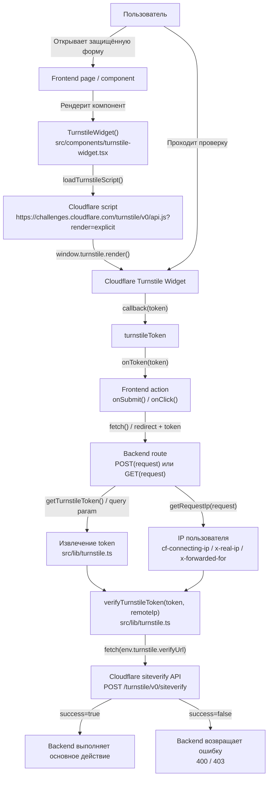
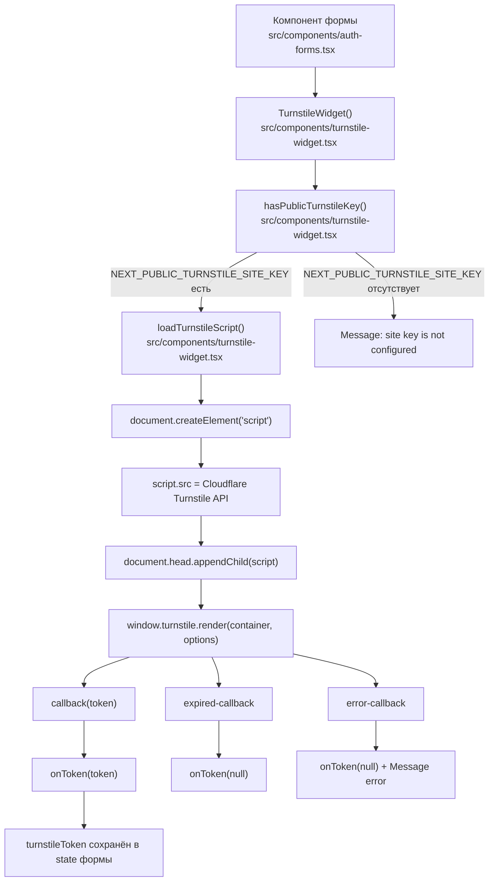
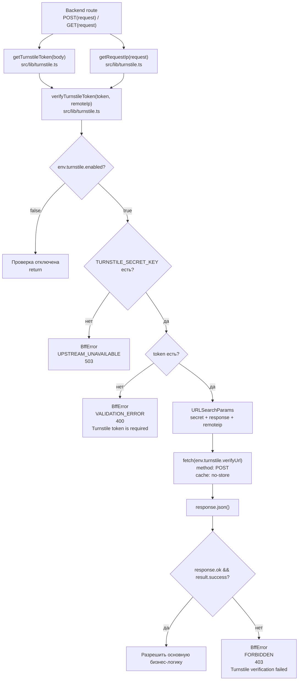
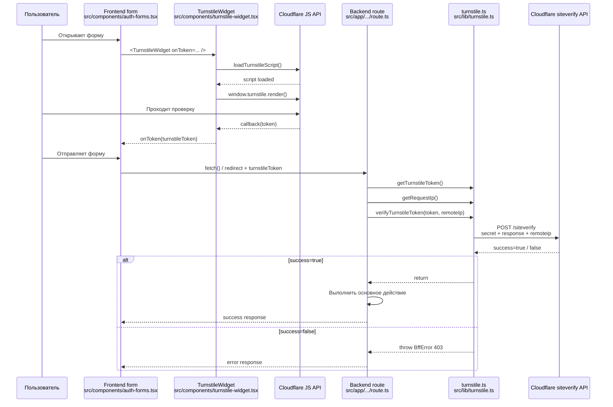
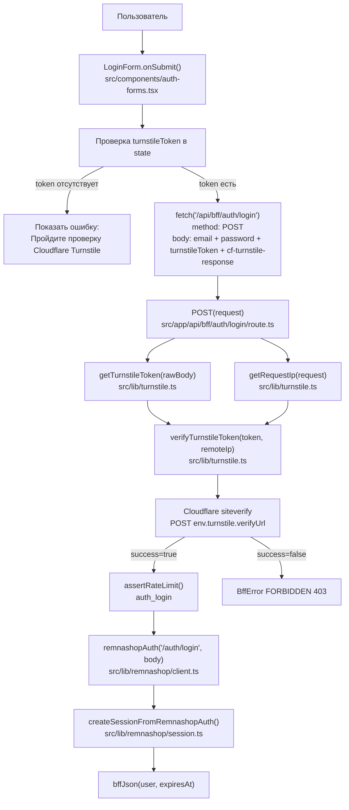
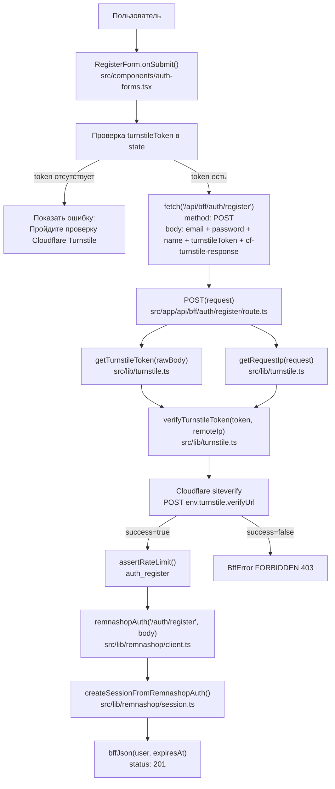
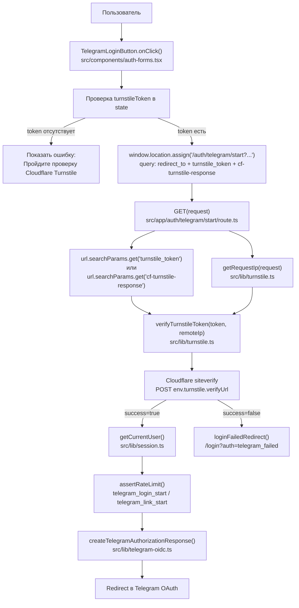
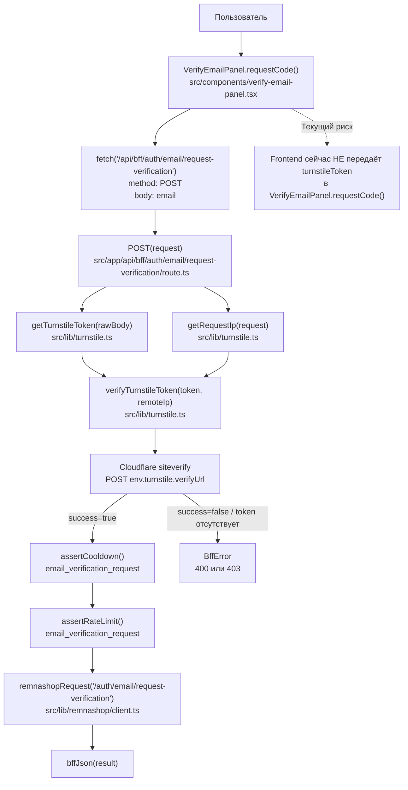
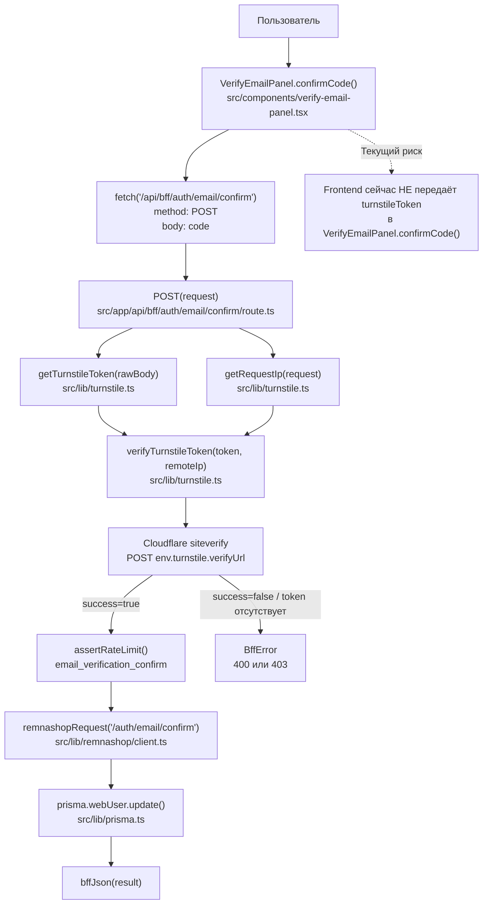
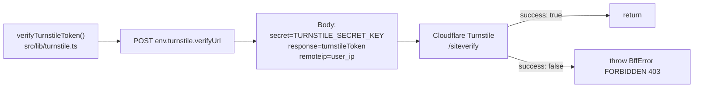

# Cloudflare Turnstile Flow с Mermaid и вызовами `метод / файл`

## Назначение

Cloudflare Turnstile используется как server-side проверка перед чувствительными действиями.

Интеграция состоит из двух частей:

```text
Frontend:
получает одноразовый turnstileToken от Cloudflare

Backend:
проверяет turnstileToken через Cloudflare siteverify API
```

---

## Основные env-переменные

```env
TURNSTILE_ENABLED="true"
NEXT_PUBLIC_TURNSTILE_SITE_KEY="..."
TURNSTILE_SECRET_KEY="..."
TURNSTILE_VERIFY_URL="https://challenges.cloudflare.com/turnstile/v0/siteverify"
```

Где читаются:

```text
getEnv()
src/lib/env.ts
```

---

# 1. Общий flow интеграции



---

# 2. Frontend flow: загрузка Turnstile widget



---

# 3. Backend flow: проверка token через Cloudflare



---

# 4. Sequence diagram с методами и файлами



---

# 5. Карта вызовов `действие → метод → файл`

| Действие | Frontend метод / файл | HTTP-вызов | Backend метод / файл | Turnstile-вызовы |
|---|---|---|---|---|
| Логин | `LoginForm.onSubmit()`<br/>`src/components/auth-forms.tsx` | `POST /api/bff/auth/login` | `POST(request)`<br/>`src/app/api/bff/auth/login/route.ts` | `getTurnstileToken()`<br/>`getRequestIp()`<br/>`verifyTurnstileToken()`<br/>`src/lib/turnstile.ts` |
| Регистрация | `RegisterForm.onSubmit()`<br/>`src/components/auth-forms.tsx` | `POST /api/bff/auth/register` | `POST(request)`<br/>`src/app/api/bff/auth/register/route.ts` | `getTurnstileToken()`<br/>`getRequestIp()`<br/>`verifyTurnstileToken()`<br/>`src/lib/turnstile.ts` |
| Telegram login/link start | `TelegramLoginButton.onClick()`<br/>`src/components/auth-forms.tsx` | `GET /auth/telegram/start?turnstile_token=...` | `GET(request)`<br/>`src/app/auth/telegram/start/route.ts` | `getRequestIp()`<br/>`verifyTurnstileToken()`<br/>`src/lib/turnstile.ts` |
| Запрос e-mail кода | `VerifyEmailPanel.requestCode()`<br/>`src/components/verify-email-panel.tsx` | `POST /api/bff/auth/email/request-verification` | `POST(request)`<br/>`src/app/api/bff/auth/email/request-verification/route.ts` | `getTurnstileToken()`<br/>`getRequestIp()`<br/>`verifyTurnstileToken()`<br/>`src/lib/turnstile.ts` |
| Подтверждение e-mail кода | `VerifyEmailPanel.confirmCode()`<br/>`src/components/verify-email-panel.tsx` | `POST /api/bff/auth/email/confirm` | `POST(request)`<br/>`src/app/api/bff/auth/email/confirm/route.ts` | `getTurnstileToken()`<br/>`getRequestIp()`<br/>`verifyTurnstileToken()`<br/>`src/lib/turnstile.ts` |

---

# 6. Flow логина с методами и файлами



---

# 7. Flow регистрации с методами и файлами



---

# 8. Flow Telegram login/link start с методами и файлами



---

# 9. Flow запроса e-mail кода с методами и файлами



---

# 10. Flow подтверждения e-mail кода с методами и файлами



---

# 11. Внутренние функции Turnstile

## `getTurnstileToken()`

```text
Файл:
src/lib/turnstile.ts

Метод:
getTurnstileToken(body)

Назначение:
достаёт token из body.
```

Поддерживаемые поля:

```text
turnstileToken
cf-turnstile-response
```

---

## `getRequestIp()`

```text
Файл:
src/lib/turnstile.ts

Метод:
getRequestIp(request)

Назначение:
определяет IP пользователя для передачи в Cloudflare siteverify.
```

Порядок чтения заголовков:

```text
1. cf-connecting-ip
2. x-real-ip
3. x-forwarded-for
```

---

## `verifyTurnstileToken()`

```text
Файл:
src/lib/turnstile.ts

Метод:
verifyTurnstileToken(token, remoteIp)
```

Что делает:

```text
1. Читает env через getEnv()
2. Если TURNSTILE_ENABLED=false — пропускает проверку
3. Проверяет наличие TURNSTILE_SECRET_KEY
4. Проверяет наличие token
5. Формирует URLSearchParams:
   - secret
   - response
   - remoteip
6. Делает fetch(env.turnstile.verifyUrl)
7. Проверяет response.ok и result.success
8. При ошибке выбрасывает BffError
```

---

# 12. Cloudflare API вызов



Фактический endpoint по умолчанию:

```text
https://challenges.cloudflare.com/turnstile/v0/siteverify
```

---

# 13. Текущие проблемы / замечания по реализации

## 13.1. E-mail verification backend защищён Turnstile, но frontend не отправляет token

Backend routes требуют Turnstile:

```text
src/app/api/bff/auth/email/request-verification/route.ts
src/app/api/bff/auth/email/confirm/route.ts
```

В них вызывается:

```text
getTurnstileToken()
verifyTurnstileToken()
```

Но frontend-компонент:

```text
src/components/verify-email-panel.tsx
```

сейчас отправляет только:

```json
{
  "email": "user@example.com"
}
```

и:

```json
{
  "code": "000000"
}
```

Без:

```text
turnstileToken
cf-turnstile-response
```

### Последствие

Если:

```env
TURNSTILE_ENABLED="true"
```

то запросы:

```text
POST /api/bff/auth/email/request-verification
POST /api/bff/auth/email/confirm
```

могут возвращать ошибку:

```text
400 Turnstile token is required
```

### Что нужно доработать

В `src/components/verify-email-panel.tsx` нужно добавить:

```text
TurnstileWidget
turnstileToken state
передачу turnstileToken в requestCode()
передачу turnstileToken в confirmCode()
reset widget при ошибке
```

---

## 13.2. Покупка и продление подписки сейчас не защищены Turnstile

В текущем коде Turnstile не вызывается в:

```text
src/app/api/bff/subscription/purchase/route.ts
src/app/api/bff/subscription/extend/route.ts
```

Там нет вызовов:

```text
getTurnstileToken()
verifyTurnstileToken()
```

Если требуется защищать покупку и продление подписки через Cloudflare Turnstile, нужно отдельно добавить token на frontend и проверку на backend.

---

# 14. Итоговая схема покрытия

| Функция | Frontend token есть | Backend проверка есть | Статус |
|---|---:|---:|---|
| Логин | Да | Да | Рабочая интеграция |
| Регистрация | Да | Да | Рабочая интеграция |
| Telegram login/link start | Да | Да | Рабочая интеграция |
| Запрос e-mail кода | Нет | Да | Требует доработки frontend |
| Подтверждение e-mail кода | Нет | Да | Требует доработки frontend |
| Покупка подписки | Нет | Нет | Turnstile не подключён |
| Продление подписки | Нет | Нет | Turnstile не подключён |

---

# 15. Краткий итог

```text
TurnstileWidget
src/components/turnstile-widget.tsx
   ↓
получает token от Cloudflare
   ↓
Frontend forms
src/components/auth-forms.tsx
   ↓
передают token в BFF routes
   ↓
BFF routes
src/app/.../route.ts
   ↓
verifyTurnstileToken()
src/lib/turnstile.ts
   ↓
Cloudflare siteverify API
   ↓
success=true → выполнить действие
success=false → отклонить запрос
```
